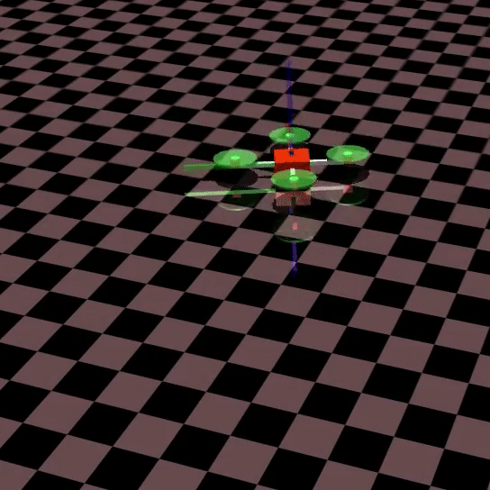
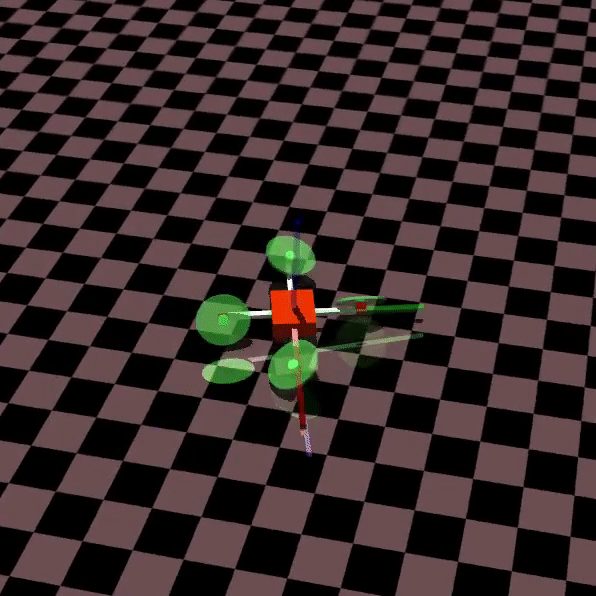

# gym_multirotor

Gym to train reinforcement learning agents on UAV platforms

Quadrotor  |  Tiltrotor
:-------------------------:|:-------------------------:
 | 

## Requirements
This package has been tested on Ubuntu 18.04 with `python 3.6`.
```
python=3.6
numpy
scipy
gym
mujoco_py
```

* To install `gym` refer [this link](https://github.com/openai/gym).
* To install `MuJoCo` refer [this link](https://github.com/openai/mujoco-py#obtaining-the-binaries-and-license-key).

## Installation
To install, you will have to clone this repository on your personal machine. Follow the below commands:  
```
$ git clone https://github.com/adipandas/gym_multirotor.git
$ cd gym_multirotor
$ pip install -e .
```

## Environments
List of environments available in this repository include:  

Environment-ID | Description
--- | ---
`QuadrotorPlusHoverEnv-v0` | Quadrotor with `+` configuration with task to hover.
`TiltrotorPlus8DofHoverEnv-v0` | Tiltrotor with `+` configuration.
`QuadrotorXHoverEnv-v0` | Quadrotor with `x` configuration with a task to hover.

### References
[REFERENCES.md](REFERENCES.md)


## Citation

If you find this work useful, please cite our work:
```
@inproceedings{deshpande2020developmental,
  title={Developmental reinforcement learning of control policy of a quadcopter UAV with thrust vectoring rotors},
  author={Deshpande, Aditya M and Kumar, Rumit and Minai, Ali A and Kumar, Manish},
  booktitle={Dynamic Systems and Control Conference},
  volume={84287},
  pages={V002T36A011},
  year={2020},
  organization={American Society of Mechanical Engineers}
}
```

## Notes:
* Some of the environment parameters have been updated but the task of these drone environments still remains the same as what was discussed in the paper.
* I will keep on updating these codes as I make further progress in my work.

